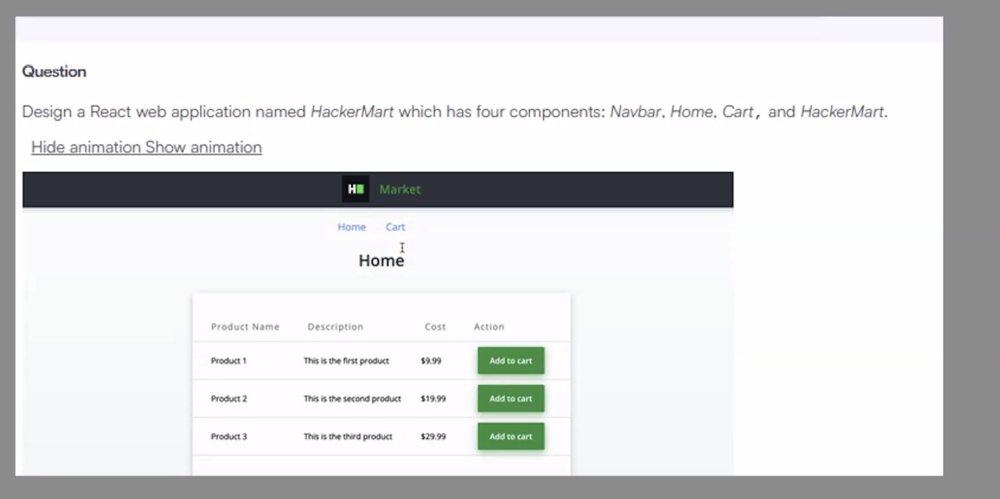
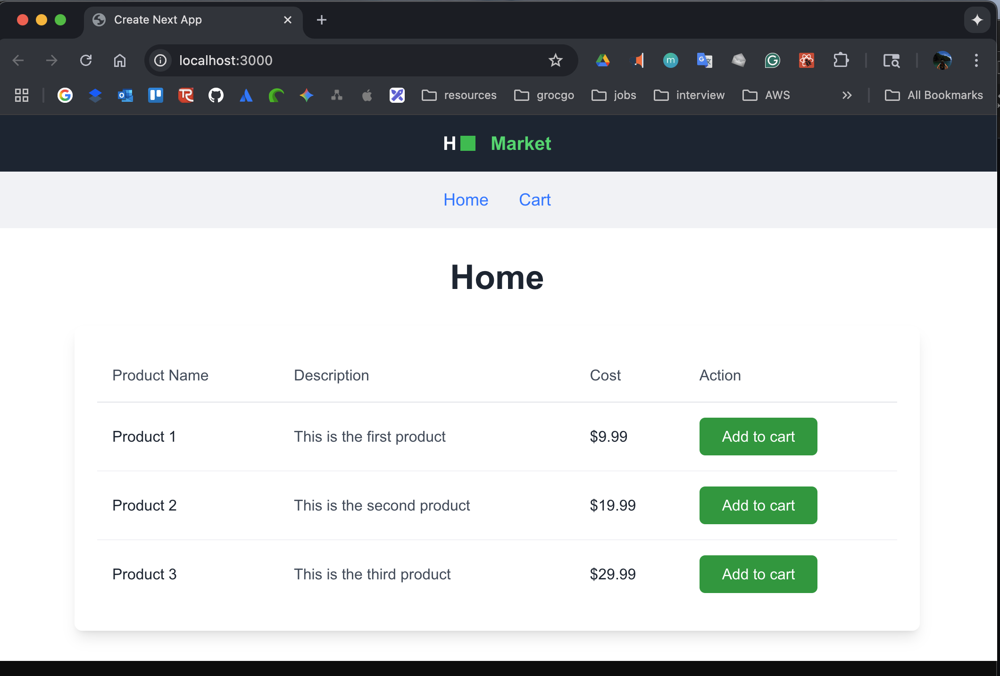

# Introduction

This is a step-by-step guide on how I created a this application based on the provided UI design.



# nstallation & Setup

## Installation

### Install Node.js & Next.js

```bash
# 1. Navigate to the project directory
cd */frontend/products

# 2. Install dependencies
npm install

# 3. Start the development server
npm run dev
npminstall
```

# Create Next.js project

# Make sure Django backend is running on port 8000

pythonmanage.pyrunserver127.0.0.1:8000


npxcreate-next-app@latestproducts--typescript--tailwind--eslint--app

cdproducts

npminstall

## Backend

### Technology Stack

-**Framework**: Django 5.2.5

-**API**: Django REST Framework

-**Database**: SQLite (default)

-**CORS**: django-cors-headers

-**Language**: Python 3.13

### Step 1: Creating Models

Create Django models to define your database structure and data relationships.

Define the Product model with fields for name, description, cost, and action to store product information in the database.

**File:** [products/models.py](vscode-file://vscode-app/Applications/Visual%20Studio%20Code.app/Contents/Resources/app/out/vs/code/electron-browser/workbench/workbench.html)

### Step 2: Adding the Serializer

Create Django REST Framework serializers to convert model instances to JSON format for API responses and handle data validation.

Define the ProductSerializer to handle serialization and deserialization of Product model data for API endpoints.

**File:** `products/serializers.py`

### Step 3: Adding API

Create Django REST Framework ViewSets to handle HTTP requests and provide CRUD operations for the Product model through API endpoints.

Define the ProductsViewSet using ModelViewSet to automatically generate API endpoints for creating, reading, updating, and deleting products.

**File:** [products/api.py](vscode-file://vscode-app/Applications/Visual%20Studio%20Code.app/Contents/Resources/app/out/vs/code/electron-browser/workbench/workbench.html)

### Step 4: Adding URLs

Configure URL routing to connect API endpoints with ViewSets and make the Product API accessible through HTTP requests.

Define URL patterns using Django REST Framework routers to automatically generate RESTful API endpoints for the ProductsViewSet.

**File:** [products/urls.py](vscode-file://vscode-app/Applications/Visual%20Studio%20Code.app/Contents/Resources/app/out/vs/code/electron-browser/workbench/workbench.html)

### Step 5: Updating Configuration

Configure Django settings to enable REST Framework, CORS support, and register the products app for proper API functionality.

Update the settings.py file to include necessary apps and middleware for Django REST Framework and CORS handling.

**File:** [backend/settings.py](vscode-file://vscode-app/Applications/Visual%20Studio%20Code.app/Contents/Resources/app/out/vs/code/electron-browser/workbench/workbench.html)

```
INSTALLED_APPS = [
    # ...existing apps...
    'corsheaders',
    'rest_framework',
    'products'
]MIDDLEWARE = [
    'corsheaders.middleware.CorsMiddleware',
    # ...existing middleware...
]CORS_ALLOWED_ORIGINS = [
    "http://localhost:3000",# Next.js frontend
```

### Step 6: Update URL Configuration

Configure the main URL routing to include the products app URLs and enable access to the API endpoints.

**File:**[backend/urls.py

](vscode-file://vscode-app/Applications/Visual%20Studio%20Code.app/Contents/Resources/app/out/vs/code/electron-browser/workbench/workbench.html)

[
](vscode-file://vscode-app/Applications/Visual%20Studio%20Code.app/Contents/Resources/app/out/vs/code/electron-browser/workbench/workbench.html)

### Step 7: Migrate and Run

Apply database migrations to create the Product model table and start the Django development server.

Create and apply migrations for the Product model, then start the development server to make the API accessible.

## Note

Create a Python script to automatically load sample product data into the backend API for testing and development purposes.

**File:** `HelperApp/AddProductToBackend.py`

---

### Overview

The application consists of a Next.js frontend that displays products in a table format with an "Add to cart" functionality and a cart counter.

#### Step 1: Project Setup

* Created a Next.js project with TypeScript
* Set up the folder structure with components and actions directories

#### Step 2: Created the Top Panel Component

**File:** [TopPanel.tsx](vscode-file://vscode-app/Applications/Visual%20Studio%20Code.app/Contents/Resources/app/out/vs/code/electron-browser/workbench/workbench.html)

#### Step 3: Created the Navigation Component

**File:** [Navigation.tsx](vscode-file://vscode-app/Applications/Visual%20Studio%20Code.app/Contents/Resources/app/out/vs/code/electron-browser/workbench/workbench.html)

Input: Cart counter that shows the number of items added

#### Step 4: Created the Product Table Component

**File:** [ProductTable.tsx](vscode-file://vscode-app/Applications/Visual%20Studio%20Code.app/Contents/Resources/app/out/vs/code/electron-browser/workbench/workbench.html)

* Table layout with columns: Product Name, Description, Cost, Action
* Dynamic rendering of products from props
* Green "Add to cart" buttons
* Click handler for adding items to cart

#### Step 5: Created API Integration

**File:** [getProducts.js](vscode-file://vscode-app/Applications/Visual%20Studio%20Code.app/Contents/Resources/app/out/vs/code/electron-browser/workbench/workbench.html)

* Async function for fetching products from the backend
* Error handling for API calls
* Returns products array from Django API from "http://127.0.0.1:8000/api/products/"

#### Step 6: Created the Main Page Component

**File:** [page.tsx
](vscode-file://vscode-app/Applications/Visual%20Studio%20Code.app/Contents/Resources/app/out/vs/code/electron-browser/workbench/workbench.html)

##### States

[ cartCount](vscode-file://vscode-app/Applications/Visual%20Studio%20Code.app/Contents/Resources/app/out/vs/code/electron-browser/workbench/workbench.html) | **Purpose** : Tracks the total number of items added to cart

[products](vscode-file://vscode-app/Applications/Visual%20Studio%20Code.app/Contents/Resources/app/out/vs/code/electron-browser/workbench/workbench.html) |  **Purpose** : Stores the list of products fetched from the API

[selectedProductList](vscode-file://vscode-app/Applications/Visual%20Studio%20Code.app/Contents/Resources/app/out/vs/code/electron-browser/workbench/workbench.html) | **Purpose** : Stores all products that have been added to cart

##### Functions

[handleAddToCart(productId: number)](vscode-file://vscode-app/Applications/Visual%20Studio%20Code.app/Contents/Resources/app/out/vs/code/electron-browser/workbench/workbench.html) | **Purpose** : Handles adding a product to the cart when button is clicked

[fetchProducts()](vscode-file://vscode-app/Applications/Visual%20Studio%20Code.app/Contents/Resources/app/out/vs/code/electron-browser/workbench/workbench.html) (inside useEffect) | **Purpose** : Fetches products from the backend API when component loads

## File Structure

frontend/products/
├── app/
 │   ├── actions/
 │    │   └── getProducts.js
 │   └── page.tsx
└── components/
    ├── TopPanel.tsx
    ├── Navigation.tsx
    └── ProductTable.tsx

# Final result


